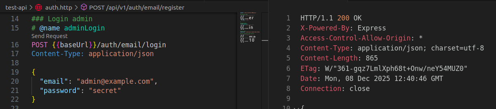
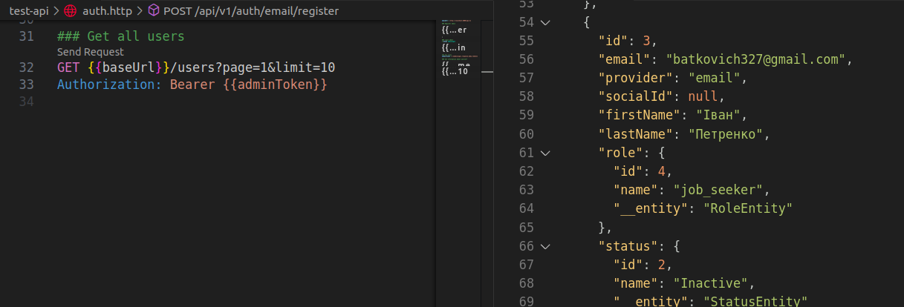
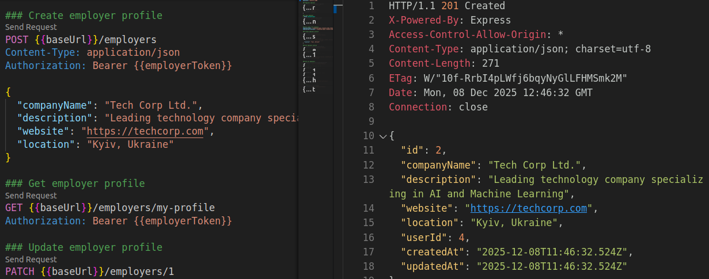
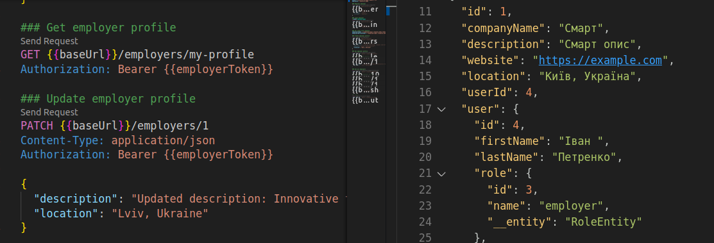
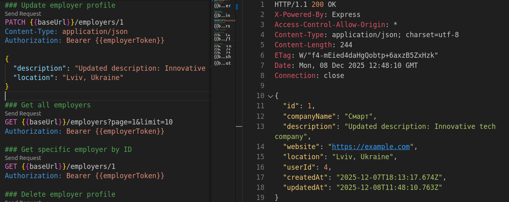
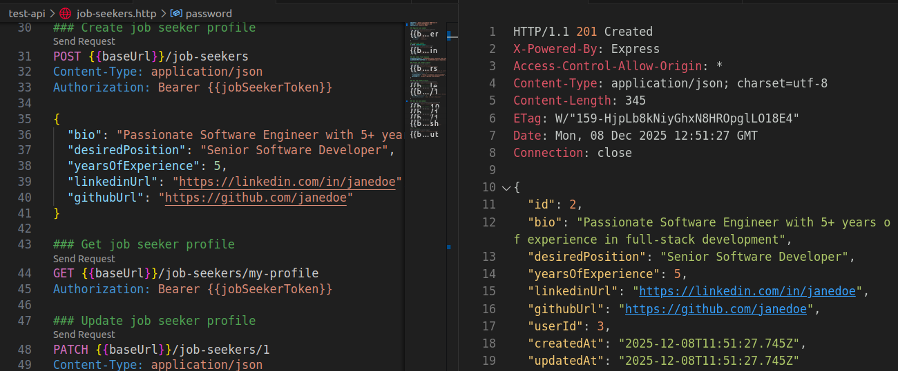
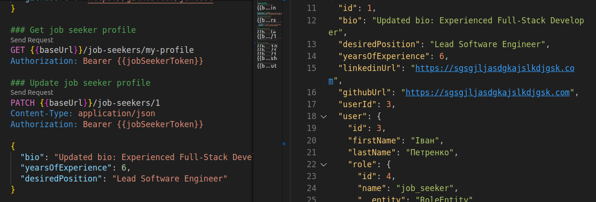

# JobFortune

> **JobFortune** — це веб-сервіс для пошуку роботи та управління вакансіями.  

---

## Основна ідея

JobFortune — це платформа, що з’єднує роботодавців і шукачів роботи.  
Кандидати можуть переглядати вакансії, створювати профілі, відгукуватися на пропозиції, а роботодавець — додавати нові вакансії та переглядати кандидатів.

---

## Основний функціонал

### Для кандидатів:
- Реєстрація та авторизація
- Створення та редагування профілю
- Перегляд доступних вакансій
- Відгук на вакансію

### Для роботодавців:
- Створення профілю
- Додавання, редагування, видалення вакансій
- Перегляд кандидатів, що подали заявки

### Для всіх користувачів:
- Авторизація
- Перегляд детальної інформації про вакансію
- Базова фільтрація вакансій

---

## Технічні вимоги

| Категорія | Використані технології |
|------------|------------------------|
| **Back-End Framework** | NestJS |
| **База даних** | PostgreSQL |
| **Аутентифікація** | JWT |
| **Мова програмування** | TypeScript |
| **Середовище запуску** | Node.js (v20+) |
| **Менеджер пакетів** | npm |

---

## Тестування API

Проєкт містить HTTP файли для тестування API endpoints у директорії `test-api/`:

- `auth.http` - тестування аутентифікації
- `employers.http` - тестування endpoints роботодавців
- `job-seekers.http` - тестування endpoints шукачів роботи
- `jobs.http` - тестування endpoints вакансій

### Приклади тестування з використанням REST Client

#### Аутентифікація

**Реєстрація нового користувача:**

**Вхід в систему:**

---

#### Роботодавці (Employers)

**Створення профілю роботодавця:**

**Отримання профілю роботодавця:**

**Оновлення профілю роботодавця:**

---

#### Шукачі роботи (Job Seekers)

**Створення профілю шукача роботи:**

**Отримання профілю шукача роботи:**

---
